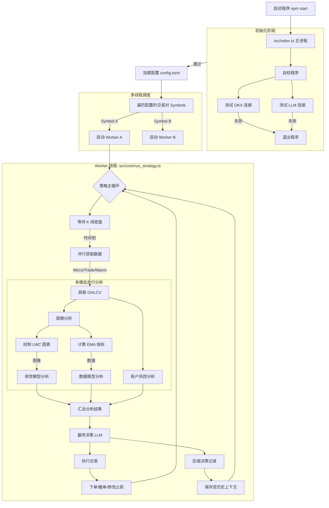

# llm-trade-v3

**llm-trade-v3** 是一个基于 LLM（大语言模型）的加密货币自动交易系统。它利用多周期 K 线数据、技术指标（EMA）以及图表视觉分析，结合先进的 LLM 推理能力（OpenAI/Gemini），实现全自动的趋势跟踪与交易决策。

## 🚀 功能特性

*   **多周期分析**：同时监控微观（Micro）、交易（Trade）、宏观（Macro）三个时间周期的市场走势。
*   **多模态融合**：结合数值数据（OHLCV + EMA）与视觉图表（K 线图截图），提供更全面的市场认知。
*   **LLM 驱动决策**：
    *   使用视觉模型（如 Gemini Flash）分析 K 线形态与结构。
    *   使用推理模型（如 GPT-OSS）进行深度数据分析与威科夫理论研判。
    *   综合多方信息输出最终交易决策（开多/开空/平仓/观望）。
*   **智能风控**：实时监控账户维持保证金率与持仓风险，动态调整止损与仓位。
*   **历史记忆压缩**：将历史决策压缩为简短摘要，为当前决策提供上下文记忆。
*   **多线程架构**：支持多币种并行运行，每个交易对运行在独立的 Worker 线程中。

## 🛠️ 安装与运行

### 前置要求

*   Node.js (v18+)
*   npm 或 yarn
*   OKX 交易所 API Key (需要 V5 API)
*   OpenAI/Google Gemini API Key

### 安装依赖

```bash
npm install
```

### 配置

1.  复制环境变量示例文件：
    ```bash
    cp .env.example .env
    ```
2.  编辑 `.env` 文件，填入 API Key 等敏感信息。
3.  复制并编辑配置文件：
    ```bash
    cp config.example.toml config.toml
    ```
4.  编辑 `config.toml` 文件，调整交易参数与模型配置：
    *   `[candle]`：设置 K 线周期（如 1H, 4H, 1D）。
    *   `[trade]`：设置交易对、杠杆倍数、风险比例。
    *   `[llm]`：选择使用的大模型及其参数。

### 运行

开发模式（使用 ts-node）：
```bash
npm start
```

构建并运行：
```bash
npm run build
node dist/index.js
```

## 🧩 系统架构与流程

本系统采用主从架构，主进程负责初始化与 Worker 调度，子进程负责具体的策略执行。

### 核心运行流程图



### 目录结构

*   `src/index.ts`: 程序入口，负责自检与 Worker 启动。
*   `src/core/`: 核心逻辑目录。
    *   `run_strategy.ts`: 策略主循环，协调数据获取与分析。
    *   `analyze_functions.ts`: 调用 LLM 进行分析的具体实现。
    *   `trade_functions.ts`: 交易执行逻辑。
*   `src/connect/`: 外部连接器。
    *   `exchange.ts`: OKX API 封装。
    *   `openai.ts`: LLM 接口封装。
*   `src/util/`: 工具函数（绘图、指标计算、配置读取等）。
*   `config.toml`: 全局配置文件。

## 📄 许可证

ISC
