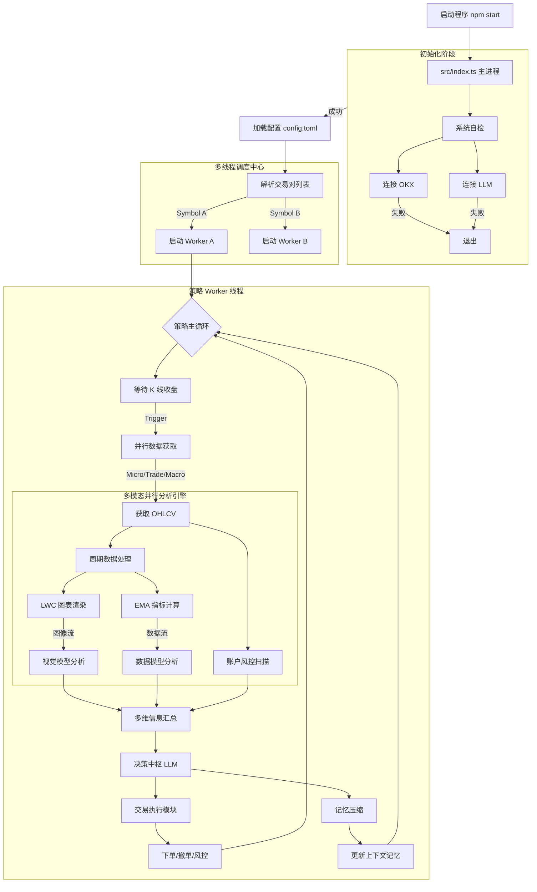

# OmniTrade AI

**OmniTrade AI** 是一款先进的多模态加密货币自主交易系统。它融合了微观、交易、宏观等多周期市场洞察，利用前沿的大语言模型（LLM）进行视觉图表分析与深度数据推理，实现全自动的趋势跟踪与智能决策。

## 🚀 功能特性

*   **全维多周期分析**：同步监控微观（Micro）、交易（Trade）、宏观（Macro）三个维度的市场走势，捕捉从日内波动到长期趋势的每一个机会。
*   **多模态智能融合**：创新性地结合数值数据（OHLCV + EMA）与视觉图表（K 线图截图），模拟人类交易员的“盘感”与逻辑分析。
*   **LLM 驱动决策引擎**：
    *   **视觉感知**：利用视觉大模型（如 Gemini Flash）精准识别 K 线形态、支撑压力位及价格行为。
    *   **逻辑推理**：利用推理大模型（如 GPT-4o/GPT-OSS）结合威科夫理论进行深度市场研判。
    *   **综合决策**：多维信息汇总，输出明确的交易指令（开多/开空/平仓/观望）。
*   **动态智能风控**：实时监控账户权益与维持保证金率，动态调整止损位置与仓位大小，确保资金安全。
*   **上下文记忆压缩**：独特的历史记忆机制，将过往决策压缩为简明摘要，为当前决策提供连贯的上下文支持。
*   **高并发多线程架构**：采用主从架构设计，支持多币种并行交易，每个交易对独立运行于 Worker 线程中，互不干扰。

## 🛠️ 安装与运行

### 前置要求

*   Node.js (v18+)
*   npm 或 yarn
*   OKX 交易所 API Key (需支持 V5 API)
*   OpenAI / Google Gemini API Key

### 安装依赖

```bash
npm install
```

### 配置指南

1.  **初始化环境变量**：
    复制示例文件并重命名为 `.env`：
    ```bash
    cp .env.example .env
    ```
    编辑 `.env` 文件，填入您的 API Key 等敏感信息。

2.  **初始化配置文件**：
    复制示例文件并重命名为 `config.toml`：
    ```bash
    cp config.example.toml config.toml
    ```

3.  **调整策略参数**：
    编辑 `config.toml` 文件，根据需求调整：
    *   `[candle]`：设定分析的时间周期（如 1H, 4H, 1D）。
    *   `[trade]`：配置交易对、杠杆倍数及风险控制参数。
    *   `[llm]`：选择并配置使用的大模型参数。

### 启动系统

**开发模式（推荐开发调试使用）：**
```bash
npm start
```

**生产环境构建与运行：**
```bash
npm run build
node dist/index.js
```

## 🧩 系统架构

本系统采用稳健的主从（Master-Worker）架构，主进程负责系统初始化、自检与 Worker 调度，子进程负责具体的策略计算与交易执行。

### 核心运行流程



### 目录结构说明

*   `src/index.ts`: **系统入口** - 负责环境检查、配置加载与 Worker 启动。
*   `src/core/`: **核心逻辑**
    *   `run_strategy.ts`: 策略生命周期管理。
    *   `analyze_functions.ts`: LLM 分析接口实现。
    *   `trade_functions.ts`: 交易指令执行与订单管理。
*   `src/connect/`: **外部连接适配器**
    *   `exchange.ts`: OKX V5 API 封装。
    *   `openai.ts`: LLM API (OpenAI/Gemini) 标准化封装。
*   `src/util/`: **通用工具库** - 包含图表绘制、指标算法、日志管理等。
*   `config.toml`: **全局配置文件** - 集中管理策略与系统参数。

## 📄 许可证

ISC
